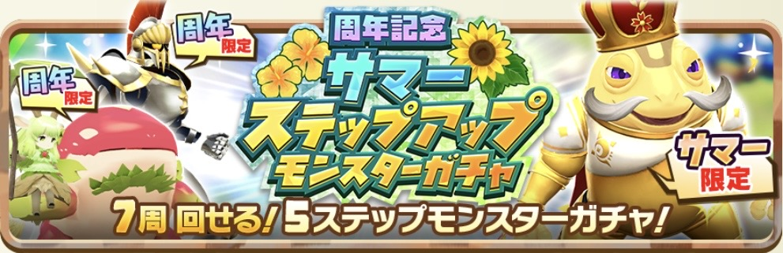
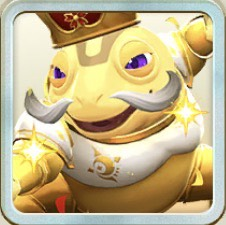

# サイト側UI改善計画（S1〜S4）

対象: 公開サイト側（`build.js` / `scripts/build-assist-pages.js` / `*.css` / 手書きHTML）
体制: 計画・検証＝チャット側 ／ 実装＝開発エージェント ／ マージ＝管理者
進捗の正: `docs/PROGRESS.md`

---

## 0. 原則（S1〜S4 共通）

1. **見た目の変更のみ。機能を壊さない。**
   絞り込みJS・インデックス判定・sitemap・広告枠・構造化データには触れない。
2. **可視文字数を減らさない。** バッジ化や文言削除で本文が痩せると、
   二軸ゲート（可視800字／独自解説300字）を割り込むページが出る。
   **アイコンだけにせず名称を必ず併記する。** 装飾ではなくインデックス維持の条件。
3. **新しい部品を増やさず、既にあるものを切り出して共有する。**
4. **1段階1PR。** 確認は各PR1回。
5. **原稿（解説文・評価テキスト）を1文字も書き換えない。**
6. **CMS UI改修（U計画）の保留項目はサイト側UI改善の対象外。着手をブロックしない。**
   `verify.js` が WARN / FAIL を出したら、まず基点 `origin/main` で同じコマンドを回して
   切り分ける。基点でも出るなら本PRの原因ではない。手を加えず実測を報告する。

---

## 1. 現在地

| # | 内容 | 状態 |
|---|---|---|
| S1 | 共通部品の切り出し（バッジ ＋ 横長カード） | **完了**（P13-1） |
| S2 | トップ画面 ＋ 一覧・モン類ページ | **完了**（P13-2） |
| S3 | アシストカード詳細 | **完了**（P13-3） |
| S4 | **ガチャ一覧・ガチャ詳細** | **未着手**（P13-5・6章が仕様） |

---

## 2. S1で作った共通部品（S4でも使う）

`style.css` にある。**同等のCSSを新しく書かないこと。**

### 2-1. バッジ

```
.badge-row / .badge-row--sm        バッジを並べる行。--sm は小サイズ
.aura-badge-lg + .aura-dot         オーラ。.aura-赤 / 青 / 黄 / 黒 / 白 / 緑 と併用
.mon-badge                         モン類
.limited-badge-inline              限定
```

並び順は **オーラ → モン類 → 限定** で固定。限定でないモンスターは限定バッジを出さない。
表記はモンスター詳細ページに合わせる。

```
オーラ  「緑オーラ」   ★ 色名だけにしない
モン類  「幻霊」
限定    limitedLabel をそのまま（「夏限定」）。ラベルが空なら「限定」
```

### 2-2. 横長カード（PC2列 / SP1列・画像の右に解説）

```
.wide-grid          2列グリッド。スマホで1列
.wide-card          画像＋本文の横並びカード
.wide-card-excerpt  解説の抜粋
```

元はモン類ページの血統別カード。S1でページ非依存の部品として切り出した。

---

## 3. S1〜S3で確定した判断（再検討しない）

```
モンスター一覧にモン類バッジは出さない（ページ内に絞り込みUIがあるため）
style.css の tr:hover td はサイト全体から削除済み
能力の2列表示は PC・スマホとも2列。1列化は選択肢に無い
ガチャ画像の aspect-ratio は 991 / 321 で固定（現存する唯一の画像の実寸）
ピックアップ枠のマーカーは、セクションの器ごと囲む形に組み替え済み（S2）
```

---

## 4. 触ってはいけないもの（S1〜S4 共通）

```
data-aura / data-mon / data-limited   monsters.html の絞り込みJSが使っている
.badge-limited                        画像右上の「限定」。バッジ行とは役割が違う
src/data/*.json                       描画の変更であってデータの変更ではない
_cms/gas/ 配下                        サイト側の作業では触らない
GACHA:* マーカーの外側                手書きHTML。ビルドが書き換えてはいけない
```

---

## 5. 保留（今回のS1〜S4では着手しない）

```
更新履歴のクローラー不可視（<script> 内のJS配列をクライアント描画）の静的化
モンスターとアシストカードで解説の描画方式が違う点の統一
ガチャ一覧の「終了」セクション（終了ガチャが出たら表示を確認して追記する）
```

---

## 6. S4 — ガチャ一覧・ガチャ詳細（未着手）

対象は `/gacha/`（一覧）と `/gacha/<gachaId>.html`（詳細）。
どちらも `build.js` が生成し、CSSは `style.css` のみを読み込んでいる。

### 6-1. 🔴 リンクの色と下線（両ページ共通・最優先）

ガチャの2ページだけ**カードの構造が他ページと違う。**

```html
<article class="card"><a href="…"> … </a></article>
```

`.card{text-decoration:none;color:inherit}` は **`.card` 自身**への指定なので、
内側の `<a>` にはブラウザ既定（`#0000ee` ＋ underline）がそのまま乗る。
他ページは全て `<a class="card">` なので起きていない。

**カード全体をリンクにして、他ページと構造を揃える。**

```html
<a class="card" href="…"> … </a>
```

**これでCSSを足さずに解決する。** ガチャ詳細のピックアップも同じ構造にする
（6-5で「詳細を見る」を消すため、カード全体がリンクである必要がある）。

⚠ 構造を変えられない箇所が出た場合のみ、保険として `.card a{color:inherit;text-decoration:none}`
を足す。**先に構造で解決すること。**

### 6-2. ガチャ一覧 — レイアウトと画像

現状 `.card-grid`（`minmax(150px,1fr)` の縦長カード用グリッド）に横長バナーを入れており、
実測で表示幅 **213px** しかない。さらに `.card-img{max-height:180px;object-fit:cover}` のため、
**幅が広がると上下が切れる。**

```css
.gacha-grid{display:grid;grid-template-columns:repeat(2,minmax(0,1fr));gap:16px}
@media (max-width:768px){ .gacha-grid{grid-template-columns:minmax(0,1fr)} }
.gacha-banner{width:100%;height:auto;max-height:none;
  aspect-ratio:991 / 321;object-fit:cover;display:block}
```

```
・.card-grid を .gacha-grid に差し替える（PC2列 / SP1列）
・バナーには .card-img を使わず .gacha-banner を使う
  ★ .card-img の max-height:180px が縦の切れる原因。流用しない
・aspect-ratio は現存する唯一のバナー画像の実寸 991×321 に合わせる
・ブレークポイントはリポジトリの既存値に合わせる（768pxは目安）
```

### 6-3. ガチャ一覧 — 見出し・分類・期間のバランス

現状 `.card-name` が14px、`<p>` はブラウザ既定の **16px**。
**分類と期間の方が見出しより大きい。** 期間にラベルも無い。

```html
<div class="card-info gacha-card-info">
  <h3 class="card-name gacha-name">周年記念サマーステップアップモンスターガチャ</h3>
  <p class="gacha-type">ステップアップモンスターガチャ</p>
  <p class="gacha-period">期間：2026年8月28日 15:00 ～ 2026年9月11日 14:59</p>
</div>
```

```css
.gacha-card-info{padding:12px 14px;text-align:left}
.gacha-name{font-size:16px;line-height:1.5;margin:0 0 8px}
.gacha-type{font-size:11px;line-height:1.5;color:#8a7a5c;margin:0 0 6px}
.gacha-period{font-size:12px;line-height:1.5;color:#5b4218;margin:0}
```

```
見出し 16px（最大） > 期間 12px > 分類 11px（最小・薄い色）
期間には「期間：」を付ける
```

⚠ **`style.css` 1行目の `*{margin:0;padding:0}` が効いている。**
余白は各クラスで明示的に指定しないと出ない。

### 6-4. ガチャ詳細 — メインビジュアルと概要行

現状はMVに `.card-img` を流用しており縦が切れる。
種別・期間は `<p>` で、`*{margin:0}` により上下の余白が完全に潰れている。

```html
<section class="section gacha-head">
  
  <dl class="gacha-meta">
    <div><dt>種別</dt><dd>ステップアップモンスターガチャ</dd></div>
    <div><dt>開催期間</dt><dd>2026年8月28日 15:00 ～ 2026年9月11日 14:59</dd></div>
  </dl>
</section>
```

```css
.gacha-hero{width:100%;height:auto;max-height:none;
  aspect-ratio:991 / 321;object-fit:cover;display:block;border-radius:8px}
.gacha-meta{margin:18px 0 0}
.gacha-meta > div{display:flex;gap:10px;padding:9px 0;border-bottom:1px solid #eee4d3}
.gacha-meta > div:last-child{border-bottom:none}
.gacha-meta dt{flex:0 0 88px;font-size:13px;font-weight:bold;color:#5b4218}
.gacha-meta dd{margin:0;font-size:13px;line-height:1.6;color:#333}
@media (max-width:600px){
  .gacha-meta > div{flex-direction:column;gap:2px}
  .gacha-meta dt{flex:none;font-size:12px}
}
```

`<p>種別: …</p>` の**コロンを含む表記をやめ、`dt`/`dd` に分ける。**

### 6-5. ガチャ詳細 — ピックアップ枠

現状は縦長カード用グリッドに150字前後の抜粋を入れているため縦に伸びる。
名前が14px・本文が既定16pxで**大小が逆転している。**

**S1で切り出した `.wide-grid` / `.wide-card` を使う。新しく作らない。**

```html
<div class="wide-grid">
  <a class="card wide-card" href="../monsters/kaibutsu/kawazumo/2580.html">
    
    <div class="card-info">
      <h3 class="card-name gacha-pickup-name">ルートヴィッヒ</h3>
      <div class="badge-row badge-row--sm">
        <span class="aura-badge-lg aura-黄"><span class="aura-dot"></span>黄オーラ</span>
        <span class="mon-badge">怪物</span>
        <span class="limited-badge-inline">限定</span>
      </div>
      <p class="gacha-pickup-blood">カワズモー（副血統: ノーブル）</p>
      <p class="gacha-pickup-rate">排出率 0.1%</p>
      <p class="wide-card-excerpt">カワズモー種としては待望の…</p>
    </div>
  </a>
</div>
```

```css
.gacha-pickup-name{font-size:15px;line-height:1.5;margin:0 0 7px}
.gacha-pickup-blood{font-size:12px;line-height:1.5;color:#6b5c42;margin:7px 0 0}
.gacha-pickup-rate{font-size:12px;line-height:1.5;font-weight:bold;color:#5b4218;margin:5px 0 0}
```

```
・「モンスター詳細を見る」「アシストカード詳細を見る」の行を削除する
  カード全体がリンクなので不要（6-1）
・名前 15px（本文より大きい）／ 血統・排出率・抜粋 12px
・排出率は他の情報と同じサイズで太字
・オーラ・モン類・限定はバッジ（S1の共通部品）
・血統「カワズモー（副血統: ノーブル）」のテキストは残す。消すと可視文字数が減る
・アシストカード側も同じ構造に揃える
```

⚠ **「詳細を見る」の削除で1件あたり十数字が減る。**
ガチャ詳細は二軸ゲート（可視800字 AND 独自解説300字）の対象。
**削除前後の可視文字数を実測し、判定が変わるページが無いことを確認する。**

### 6-6. ゼロ件のピックアップ枠を出力しない

現状、ピックアップアシストカードが0件でも
`<section>` と空の `<div class="card-grid"> </div>` が出力され、見出しだけが浮く。

**ガチャ詳細のセクションはビルドが丸ごと生成しているので、出力しないだけでよい。**

```
ピックアップモンスターが0件      → <section> ごと出力しない
ピックアップアシストカードが0件  → <section> ごと出力しない
両方0件                        → どちらも出さない（解説と関連リンクは残る）
```

⚠ **CSSの `display:none` で隠さない。** HTMLに残ると可視文字数の計算と表示がずれる。
⚠ **`:empty` セレクタも使わない。** 空白テキストノードがあるため一致しない。

### 6-7. 変更してよいファイル

```
build.js      ガチャ一覧・ガチャ詳細の生成部分のみ
style.css     .gacha-* の追加
（上記の変更による生成物 gacha/*.html）
```

`scripts/` `src/data/` `_cms/` `docs/` `assist-detail.css` `monster-detail.css`
`monster-type.css` は変更しない。
**モンスター・アシストカード・トップ・一覧の生成には触らない。**

### 6-8. 完了条件

```
node build.js && node scripts/verify.js   →  FAIL 0 / WARN 0
git status --porcelain（build後）          →  0
ガチャ一覧・詳細のリンクテキストが黒系・下線なし（.card の浮き上がりは残る）
ガチャ一覧が PC2列 / SP1列。バナーの上下が切れない
見出し > 期間 > 分類 の順に大きい。期間に「期間：」が付いている
ガチャ詳細のMVが全部入る。種別・開催期間の行に上下の余白がある
ピックアップが PC2列 / SP1列 の横長カード。「詳細を見る」が消えている
ピックアップアシストカードが0件のガチャで、そのセクションが出力されない
可視文字数の前後比較で、index / noindex の判定が変わるページが無い
```

検証ページ: `/gacha/` と `/gacha/20260828-1.html`（1440px / 375px の両方）
